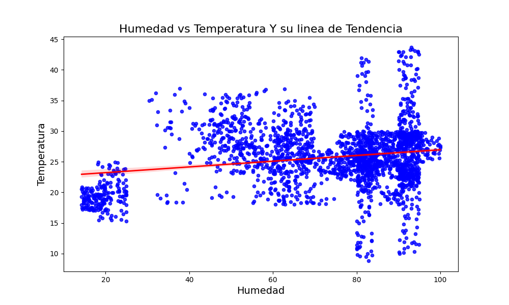
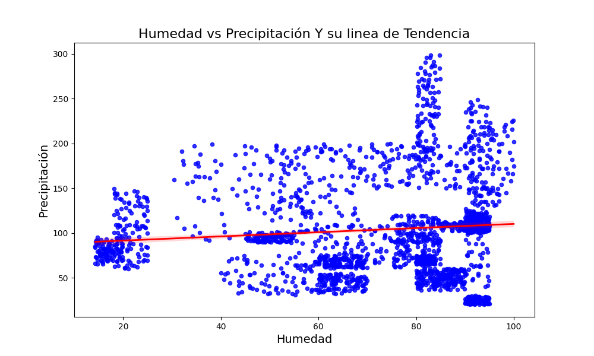
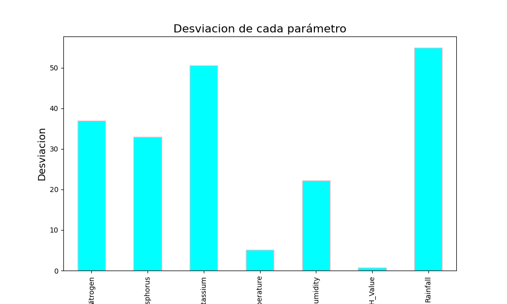
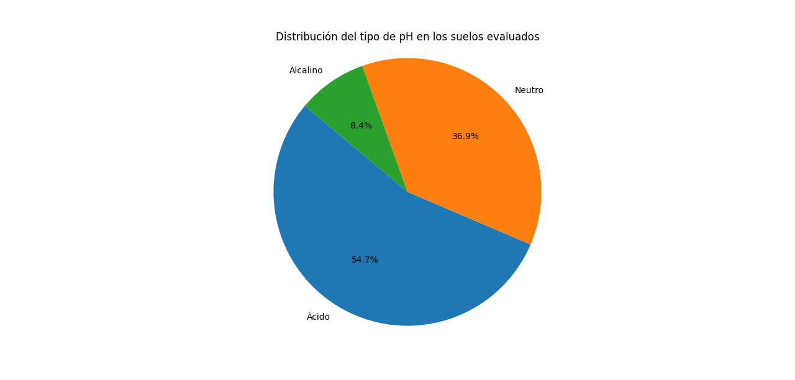

# Crop Recommendation Analysis and Visualization

This repository contains a Python script that analyzes and visualizes crop recommendation data for smart agriculture. It uses **Pandas** for data manipulation, **Matplotlib** for plotting, and **Seaborn** for statistical visualizations.

## Prerequisites

Before running the code, make sure you have the required libraries installed (I recommend use a virtual environment):

```bash
pip install pandas matplotlib seaborn
```
Additionally, you'll need a CSV file with the following columns:

- `Crop`: Type of crop
- `Humidity`: Percentage of humidity
- `Temperature`: Temperature in Celsius
- `Rainfall`: Precipitation in mm
- `pH_Value`: pH of the soil

Replace the file path in the code with the path to your own CSV file.

## How to Run

1. Clone the repository to your local machine:

```bash
git clone https://github.com/your-username/your-repository-name.git
```
2. Change the working director
```bash 
cd your-repository-name 
```
3. Run the python script 
```bash 
python Script.py 
```
## Example Plots

Here are some of the plots generated by the script:

1. **Humidity vs Temperature**: Shows the relationship between humidity and temperature with a trendline.

   

2. **Humidity vs Rainfall**: Shows the relationship between humidity and rainfall with a trendline.

   

3. **Standard Deviation of Parameters**: Displays the standard deviation of all numerical columns.

   

4. **Soil pH Distribution**: Pie chart displaying the distribution of soil types based on pH.

   

## License

This project is licensed under the MIT License 
